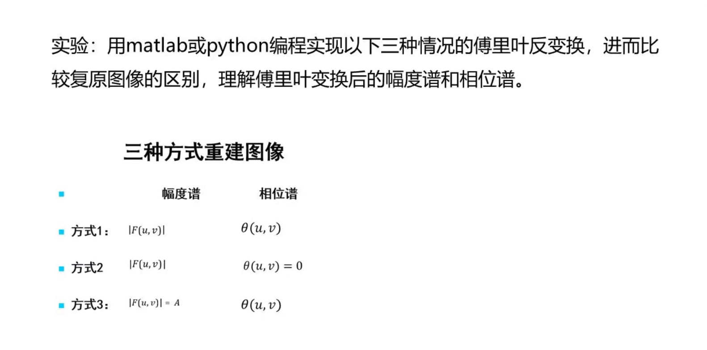

图像分析基础

实验1：使用python对图像进行处理

实验2：复现何凯明的去雾算法

实验3：离散傅里叶变换

实验4：不使用工具包的函数实现图像的平移，镜像和旋转

实验5：实现维纳滤波，要求比较信噪比未知，信噪比已知，图像和噪声自相关函数已知，这三种情况下的图像复原结果

实验6：使用DPCM编码，对随机一张灰度图片进行编码和解码，比较不同量化器（1248bit）的重建图像区别，并计算重建图像的PSNR和SSIM值

实验7：实现大津法和迭代法阈值分割，并实验比较两者的性能差别

实验8：使用openCV实现分水岭算法，并进行测试